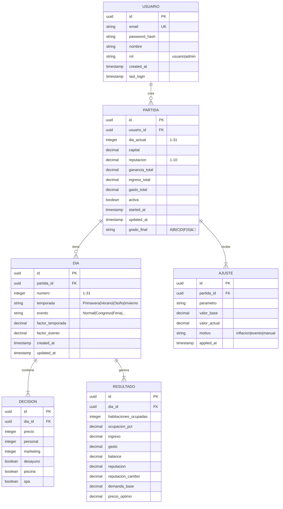

# Agentes del Sistema - Backend Hotel Magnifique

Para mantener un código limpio y modular, el backend se divide en los siguientes "agentes" lógicos:

### 1. Agente de Autenticación (Auth Agent)
- **Responsabilidad:** Gestionar el registro, login y sesiones de usuarios.
- **Tecnología:** Flask-Login o JWT.
- **Funciones:** Validar contraseñas (hashing), verificar roles (Admin vs Usuario).

### 2. Agente de Simulación (Simulation Engine)
- **Responsabilidad:** Es el núcleo del juego. Contiene las fórmulas matemáticas.
- **Funciones:** - `calculate_daily_results()`: Recibe las variables del usuario y devuelve el balance de caja, ocupación y reputación.
    - `random_event_generator()`: Determina si ocurre un evento especial en el día actual.

### 3. Agente de Persistencia (Data Agent)
- **Responsabilidad:** Comunicación con PostgreSQL.
- **Tecnología:** SQLAlchemy (ORM).
- **Funciones:** Guardar el estado del día, recuperar la partida activa y almacenar resultados históricos.

### 4. Agente de Interfaz (Template Agent)
- **Responsabilidad:** Servir el frontend dinamizado.
- **Funciones:** Inyectar los datos del backend en las plantillas de Bootstrap para que el usuario vea su progreso en tiempo real.

---

## Modelo de Datos

