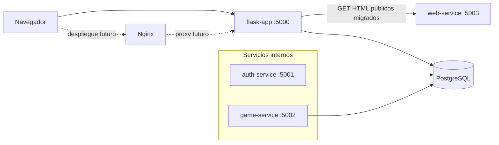

## Hotel Magnifique
Bienvenido a Hotel Magnifique, un simulador de gestión hotelera diseñado para enseñar conceptos fundamentales de economía empresarial a través de la toma de decisiones cotidianas en un hotel de lujo. 

Objetivo del Juego: Administra el Hotel Magnifique durante 30 días consecutivos tomando decisiones diarias sobre precios, personal, marketing y servicios. Tu misión es maximizar las ganancias al tiempo que construyes la reputación del hotel hasta alcanzar las 5 estrellas. 

Este juego simula los desafíos reales de la gestión hotelera. A lo largo de los 30 días practicarás conceptos como: Yield Management, Costos Fijos vs Variables, Punto de Equilibrio y Gestión de Reputación.

Creado por Cristian von Matuschka (Aoliken) backend con colaboración de Sergio Alonso (pankutan).

## Arquitectura actual

Para el despliegue actual, el punto de entrada público es `flask-app` en el puerto `5000`. No hay un proxy inverso delante de este servicio en el stack actual. Las solicitudes HTTP deben llegar a `flask-app`, que conserva las rutas de la aplicación y coordina el acceso a los demás componentes.

Los GET públicos ya migrados (`/`, `/auth/login`, `/auth/register` y `/game/no-game`) se reenvían desde `flask-app` a `web-service`; el HTML generado por ese servicio se devuelve a través de Flask. Las rutas no migradas, las operaciones de autenticación y las acciones del juego permanecen atendidas por la aplicación Flask actual.



### Responsabilidades internas

| Componente | Responsabilidad actual |
|---|---|
| `flask-app` | Punto de entrada público en `5000`; conserva las rutas de la aplicación, reenvía los GET públicos migrados y accede a los datos de la aplicación. |
| `web-service` | Genera las páginas HTML públicas migradas y sirve sus recursos estáticos. |
| `auth-service` | Gestiona la autenticación y la validación de sesiones. |
| `game-service` | Expone la API de la simulación del juego. |
| PostgreSQL | Almacena los datos persistentes de la aplicación. |

### Plantillas y renderizado

Los archivos `.ejs` son plantillas HTML del lado del servidor. En este proyecto contienen HTML y marcadores como `<%= title %>`, que se sustituyen por valores al generar la respuesta.

El renderizado actual no usa Express ni el paquete npm `ejs`. `web-service` se ejecuta con el módulo integrado `http` de Node.js y un renderizador propio: lee el archivo `.ejs` y reemplaza los marcadores admitidos antes de enviar el HTML.

### Nginx en producción

Nginx no forma parte del stack actual ni está definido en Compose. Es una capa opcional y futura para producción: podría publicar `80` y `443` y reenviar el tráfico a `flask-app:5000`. Mientras no se incorpore esa capa, `flask-app:5000` continúa siendo el punto de entrada público.

## Despliegue local

### Prerrequisitos

Tener Docker con el complemento Docker Compose instalado y un archivo `.env` configurado en la raíz del proyecto. El archivo debe incluir la configuración de base de datos que utiliza Compose (`DB_NAME`, `DB_USER` y `DB_PASSWORD`).

Antes de ejecutar herramientas de Python, activar el entorno de Conda requerido:

```shell
conda activate py3.12
```

Clonar el repositorio que está en <https://github.com/Aoliken/magnifique>

Ir a la carpeta donde estan los archivos del proyecto:

Ejemplo

```shell
cd H:\\magnifique

conda activate py3.12
pip install -r requirements.txt
```

### Iniciar el stack

Desde la raíz del proyecto, iniciar el stack con la compuerta de migraciones:

```shell
conda activate py3.12
./scripts/start-stack.sh -d
```

El comando verifica que el servicio `flask-app` exista en la configuración de Compose, ejecuta `alembic upgrade head` en ese servicio y, solo si la migración finaliza correctamente, ejecuta `docker compose up -d`.

Si la migración falla, el comando termina con el mismo código de error y no inicia el stack de la aplicación. Corregir la migración o la configuración de la base de datos antes de volver a ejecutarlo.

Para iniciar en primer plano, omitir `-d`:

```shell
./scripts/start-stack.sh
```

### Detener el stack

```shell
docker compose down
```

### Puertos y proxy inverso

Acceder a la aplicación pública por el puerto `5000` durante el desarrollo local. En producción, Nginx debe publicar los puertos `80` y `443` y reenviar las solicitudes a `flask-app:5000`.

| Puerto | Servicio | Acceso previsto | Uso |
|---|---|---|---|
| 5000 | `flask-app` | Público | Punto de entrada de la aplicación. |
| 5001 | `auth-service` | Interno | Autenticación y validación de sesiones. |
| 5002 | `game-service` | Interno | API de la simulación. |
| 5003 | `web-service` | Interno | Renderizado web del frontend. |
| 5432 | PostgreSQL | Solo desarrollo | Base de datos; no debe exponerse públicamente en producción. |

La configuración actual de Compose publica estos puertos para el desarrollo local. En producción, no publicar `5001`, `5002`, `5003` ni `5432` en el host: deben permanecer en la red interna de Docker. El proxy debe apuntar únicamente a `flask-app:5000`.

Ejemplo de bloque de servidor Nginx:

```nginx
server {
    listen 80;
    server_name example.com;

    location / {
        proxy_pass http://flask-app:5000;
        proxy_set_header Host $host;
        proxy_set_header X-Real-IP $remote_addr;
        proxy_set_header X-Forwarded-For $proxy_add_x_forwarded_for;
        proxy_set_header X-Forwarded-Proto $scheme;
    }
}
```

### Restablecer la contraseña de un administrador

Abrir la consola de Flask en el mismo entorno y contra la misma base de datos que usa la aplicación:

```shell
conda activate py3.12
flask --app run:app shell
```

En la consola, listar únicamente las cuentas administradoras y confirmar la identidad por un ID o correo electrónico conocido. No seleccionar una cuenta por coincidencias parciales:

```python
from getpass import getpass
from app import db
from app.models import Usuario

for user_id, email, nombre in db.session.query(
    Usuario.id, Usuario.email, Usuario.nombre
).filter_by(rol="admin").all():
    print(user_id, email, nombre)
```

Una vez identificado el ID correcto, restablecer la contraseña. `getpass()` no muestra la contraseña; no escribirla en el comando, no imprimirla y no guardarla en archivos ni en el historial:

```python
admin_id = "<known-admin-id>"
admin = db.session.get(Usuario, admin_id)

if admin is None or not admin.is_admin():
    raise RuntimeError("El usuario seleccionado no es administrador")

new_password = getpass("Nueva contraseña: ")
confirmation = getpass("Confirmar nueva contraseña: ")
if new_password != confirmation:
    raise RuntimeError("Las contraseñas no coinciden")

admin.set_password(new_password)
db.session.commit()
del new_password, confirmation
```

Este procedimiento actualiza solamente una cuenta existente y usa `Usuario.set_password()`, que genera el hash bcrypt compatible con el inicio de sesión. El único valor persistido es el hash; la contraseña en texto plano no se registra ni se almacena. Si no se puede confirmar la identidad del administrador, detenerse y solicitar acceso al responsable de la base de datos.

## Antes de hacer `git push` del proyecto

```bash
engram sync
```
